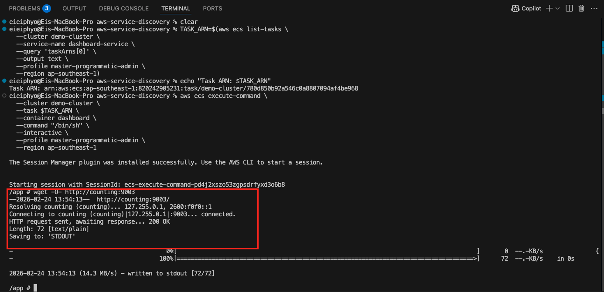
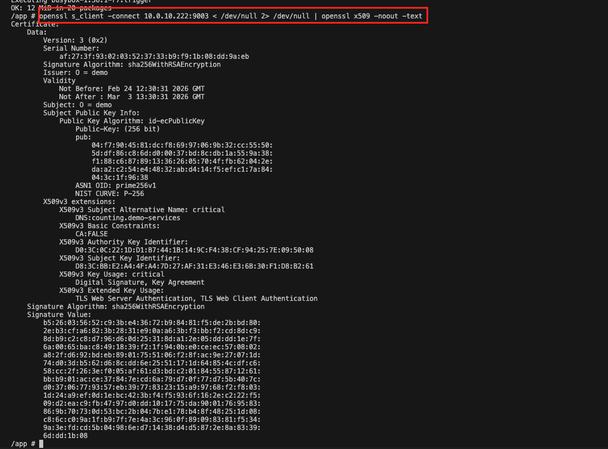
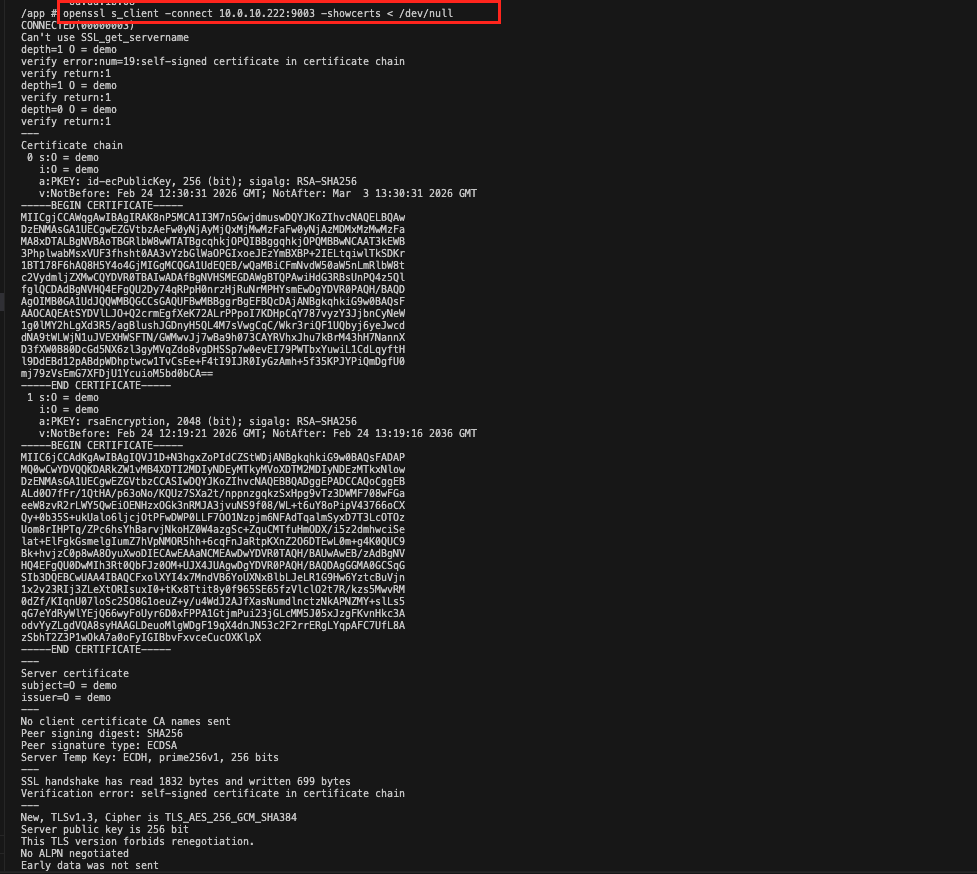
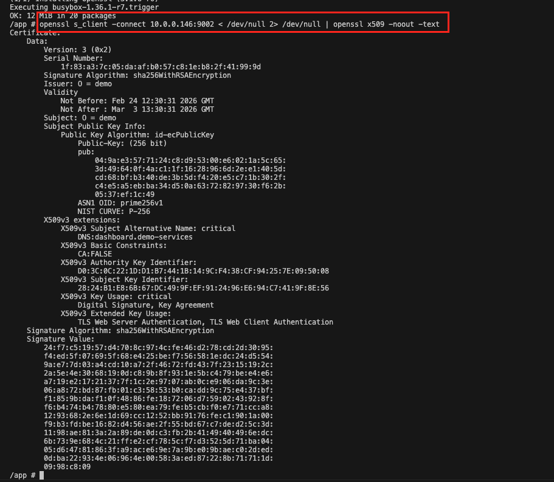
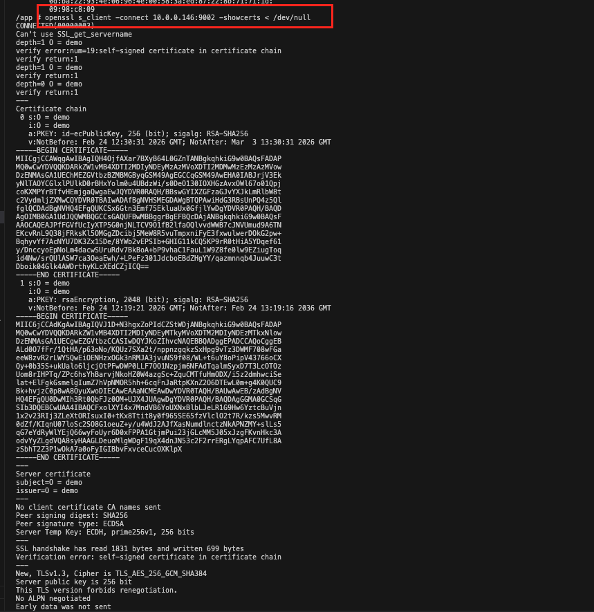

# AWS ECS Service Connect Demo

Simple microservices deployment with AWS ECS Fargate and **Service Connect**.
This infrastructure supports **Service Connect with TLS** for encrypted service-to-service communication. All service-to-service traffic will be encrypted with mutual TLS! 🔒

## 🎯 Architecture


```
Internet
    ↓
Dashboard Service (Public Subnet, Port 9002)
    ↓ Service Connect (Envoy Proxy)
Counting Service (Private Subnet, Port 9003)
```

## 🚀 Quick Start

```bash
# Deploy everything
terraform init
terraform plan
terraform apply -auto-approve
```

## 📦 What's Deployed

### Infrastructure
- **ECS Cluster**: `demo-cluster`
- **VPC**: 10.0.0.0/16 (Single AZ)
  - Public Subnet: Dashboard service
  - Private Subnet: Counting service
- **Service Connect Namespace**: `demo-service-connect`
- **CloudWatch Log Groups**: Service Connect proxy logs

### Services
- **Dashboard** (Frontend)
  - Port: 9002
  - Location: Public subnet with public IP
  - Access: Direct via public IP
  - Service Connect: **Client AND Server** mode
  - Discovery Name: `dashboard`
  
- **Counting** (Backend)
  - Port: 9003
  - Location: Private subnet
  - Access: Via Service Connect (`http://counting:9003`)
  - Service Connect: **Client AND Server** mode
  - Discovery Name: `counting`


## 📊 Security Group Rules

### Dashboard Security Group
**Purpose:** Allow public internet access and Service Connect proxy communication

| Direction | Port | Protocol | Source | Description |
|-----------|------|----------|--------|-------------|
| **Inbound** | 9002 | TCP | 0.0.0.0/0 | Allow dashboard access from internet |
| **Inbound** | All | All | Self | Allow Service Connect proxy communication |
| **Outbound** | All | All | 0.0.0.0/0 | Allow all outbound traffic |

### Counting Security Group
**Purpose:** Allow access from Dashboard service and Service Connect proxy communication

| Direction | Port | Protocol | Source | Description |
|-----------|------|----------|--------|-------------|
| **Inbound** | 9003 | TCP | Dashboard SG | Allow counting service port from dashboard |
| **Inbound** | All | All | Self | Allow Service Connect proxy communication |
| **Outbound** | All | All | 0.0.0.0/0 | Allow all outbound traffic |

### How Service Connect Works
Dashboard communicates with Counting using **AWS ECS Service Connect**:
- Dashboard uses simple DNS name: `http://counting:9003`
- Service Connect Envoy proxy intercepts the request
- Proxy load balances across all healthy counting tasks
- Automatic retries, circuit breaking, and metrics
- No hard-coded IPs needed - resilient to task restarts!

## 📋 Commands

### Get Dashboard IP
```bash
terraform output dashboard_public_ip
terraform output dashboard_url
```

### Check Services Status
```bash
aws ecs describe-services \
  --cluster demo-cluster \
  --services counting-service dashboard-service \
  --profile master-programmatic-admin \
  --region ap-southeast-1
```

### Verify Service Connect works

```bash
# Access dashboard via browser or curl
http://<dashboard_public_ip>:9002
```


### Test Service Connect and Verify TLS enabled

#### From Dashboard to Counting

```bash
# Get dashboard task ARN
TASK_ARN=$(aws ecs list-tasks \
  --cluster demo-cluster \
  --service-name dashboard-service \
  --query 'taskArns[0]' \
  --output text \
  --profile master-programmatic-admin \
  --region ap-southeast-1)

echo "Task ARN: $TASK_ARN"

# Test Service Connect endpoint
aws ecs execute-command \
  --cluster demo-cluster \
  --task $TASK_ARN \
  --container dashboard \
  --command "/bin/sh" \
  --interactive \
  --profile master-programmatic-admin \
  --region ap-southeast-1
```

```bash
# Inside the container, test Service Connect:
wget -O- http://counting:9003
```

## Evidence



```bash
## check using certificate in traffic
apk add openssl

openssl s_client -connect <counting_private_ip>:9003 < /dev/null 2> /dev/null | openssl x509 -noout -text
openssl s_client -connect <counting_private_ip>:9003 -showcerts < /dev/null
```

## Evidence






#### From Counting to Dashboard

```bash
# Get dashboard task ARN
TASK_ARN=$(aws ecs list-tasks \
  --cluster demo-cluster \
  --service-name counting-service \
  --query 'taskArns[0]' \
  --output text \
  --profile master-programmatic-admin \
  --region ap-southeast-1)

echo "Task ARN: $TASK_ARN"

# Test Service Connect endpoint
aws ecs execute-command \
  --cluster demo-cluster \
  --task $TASK_ARN \
  --container counting \
  --command "/bin/sh" \
  --interactive \
  --profile master-programmatic-admin \
  --region ap-southeast-1
```

```bash
## check using certificate in traffic
apk add openssl

openssl s_client -connect <dashboard_private_ip>:9002 < /dev/null 2> /dev/null | openssl x509 -noout -text
openssl s_client -connect <dashboard_private_ip>:9002 -showcerts < /dev/null


openssl s_client -connect 10.0.0.146:9002 < /dev/null 2> /dev/null | openssl x509 -noout -text
openssl s_client -connect 10.0.0.146:9002 -showcerts < /dev/null
```

### Evidence






## 🧹 Cleanup

```bash
terraform destroy --auto-approve
```
