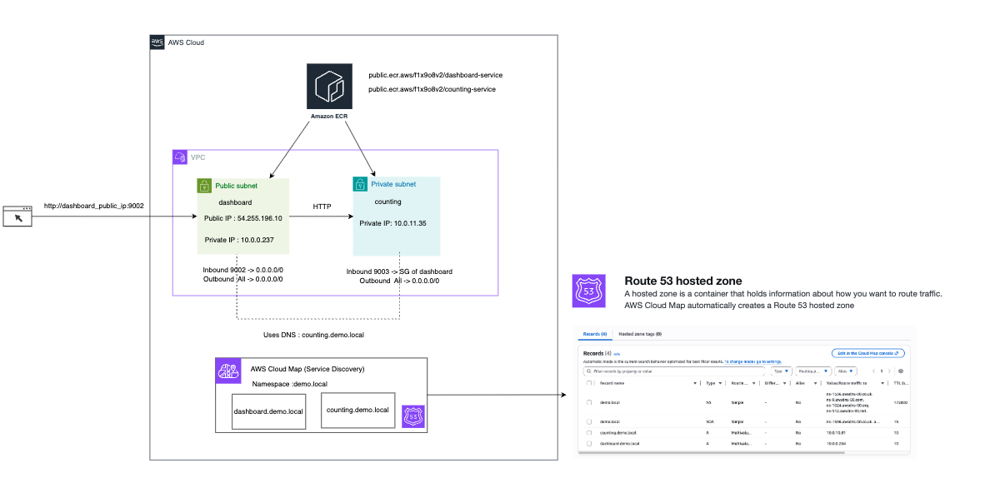
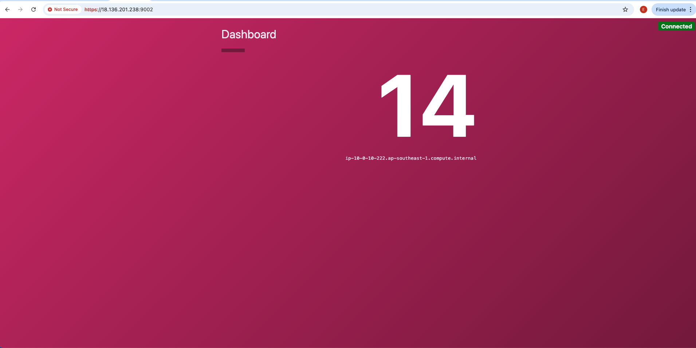
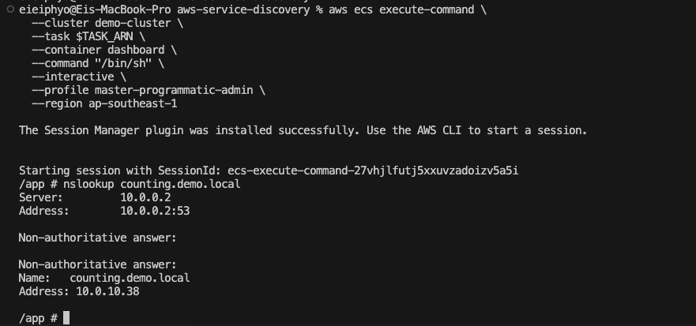

# AWS ECS Service Discovery Demo

Simple microservices deployment with AWS ECS Fargate and Service Discovery.

## 🎯 Architecture



```
Internet
    ↓
Dashboard Service (Public Subnet, Port 9002)
    ↓ Service Discovery
Counting Service (Private Subnet, Port 9003)
```

## 🚀 Quick Start

```bash
# Deploy everything
terraform apply -auto-approve
```

## 📦 What's Deployed

### Infrastructure
- **ECS Cluster**: `demo-cluster`
- **VPC**: 10.0.0.0/16 (Single AZ)
  - Public Subnet: Dashboard service
  - Private Subnet: Counting service
- **Service Discovery**: `demo.local` namespace

### Services
- **Dashboard** (Frontend)
  - Port: 9002
  - Location: Public subnet with public IP
  - Access: Direct via public IP
  
- **Counting** (Backend)
  - Port: 9003
  - Location: Private subnet
  - Access: Via service discovery (`counting.demo.local`)


## 📊 Security Group Rules

### Dashboard Security Group
**Purpose:** Allow public internet access to Dashboard service

| Direction | Port | Protocol | Source | Description |
|-----------|------|----------|--------|-------------|
| **Inbound** | 9002 | TCP | 0.0.0.0/0 | Allow dashboard access from internet |
| **Outbound** | All | All | 0.0.0.0/0 | Allow all outbound traffic |

### Counting Security Group
**Purpose:** Allow access ONLY from Dashboard service (zero-trust architecture)

| Direction | Port | Protocol | Source | Description |
|-----------|------|----------|--------|-------------|
| **Inbound** | 9003 | TCP | Dashboard SG | Allow counting service port from dashboard SG only |
| **Outbound** | All | All | 0.0.0.0/0 | Allow all outbound traffic |


### How Service Discovery Works
Dashboard communicates with Counting using **AWS Cloud Map**:
- Dashboard uses DNS name: `counting.demo.local:9003`
- Cloud Map automatically resolves to Counting's private IP
- No hard-coded IPs needed - resilient to task restarts!

## 📋 Commands

### Get Dashboard IP
```bash
terraform output dashboard_public_ip
terraform output dashboard_url
```

### Check Services Status
```bash
aws ecs describe-services \
  --cluster demo-cluster \
  --services counting-service dashboard-service \
  --profile master-programmatic-admin \
  --region ap-southeast-1
```

### Verfify Service Interconnect works

```bash
http://<dashboard_public_ip>:9002
```



### Test Service Discovery with ECS Exec

```bash
# Get dashboard task ARN
TASK_ARN=$(aws ecs list-tasks \
  --cluster demo-cluster \
  --service-name dashboard-service \
  --query 'taskArns[0]' \
  --output text \
  --profile master-programmatic-admin \
  --region ap-southeast-1)

echo "Task ARN: $TASK_ARN"

# Test DNS resolution
aws ecs execute-command \
  --cluster demo-cluster \
  --task $TASK_ARN \
  --container dashboard \
  --command "/bin/sh" \
  --interactive \
  --profile master-programmatic-admin \
  --region ap-southeast-1

nslookup counting.demo.local
```
#### Evidence 


## 🧹 Cleanup

```bash
terraform destroy --auto-approve
```
